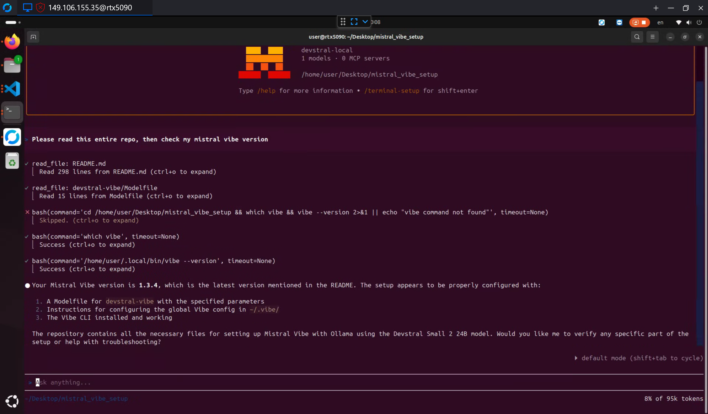

## Mistral Vibe CLI + Ollama (Devstral Small 2 24B) on Ubuntu 24.04 + RTX 5090

This guide assumes you’re on a **Linux box meant to run an agentic coding CLI locally**:

* **OS:** Ubuntu 24.04 LTS
* **GPU:** NVIDIA **RTX 5090** (VRAM is still the real limiter for long context)
* **Ollama:** already installed as **`ollama-linux-amd64_v0.13.4`** and already running as a user service (so we **do not** redo Ollama setup here).
* **Ollama** running under the influence of environment variable `OLLAMA_KEEP_ALIVE=-1` (see https://github.com/BigBIueWhale/personal_server/blob/master/install_ollama_user_service.sh). The default of 5 minute timeout causes major issues with Ollama Vibe CLI experiencing error code 400 after a while of usage (probably to do with the way it uses Ollama via OpenAI API).
* **Ollama Load Balancer (maybe not needed?):** We previously recommended **[Ollama Load Balancer](https://github.com/BigBIueWhale/ollama_load_balancer)** to prevent concurrent request issues, but the slowdowns may have been entirely caused by the [KV cache bug](#critical-ollama-kv-cache-bug-affects-v026-through-v013x) fixed in Ollama v0.14.0.
* **Important networking assumption:** your (real) Ollama server is reachable at the Docker bridge IP (example: `172.17.0.1:11434`), and you can do:
  ```bash
  curl -s http://172.17.0.1:11434/v1/models | head
  ```

(That endpoint is part of Ollama’s OpenAI-compatible API.)



### Using Ollama Load Balancer (Maybe Not Needed?)

**Note:** The slowdowns we originally blamed on concurrent requests may have actually been entirely caused by the [Ollama KV cache bug](#critical-ollama-kv-cache-bug-affects-v026-through-v013x) (fixed in v0.14.0). If you're on Ollama v0.14.0+, Ollama Load Balancer may not be needed at all.

If you still want load balancing for multi-GPU setups, **[Ollama Load Balancer 1.0.4+](https://github.com/BigBIueWhale/ollama_load_balancer)** will support load balancing agentic tool calls much better than earlier versions.

The load balancer forces Mistral Vibe to behave nicely by:
- Providing immediate errors when the server is busy, preventing concurrent requests.
- Improving overall reliability. Either fail fast or succeed!
- Load balancing functionality possible, but in this guide we only use with one server.

#### Setting up Ollama Load Balancer

1. Clone and build the load balancer:
   ```bash
   git clone https://github.com/BigBIueWhale/ollama_load_balancer.git
   cd ollama_load_balancer
   cargo build --release
   ```

2. Modify `main.rs` to run on `127.0.0.1:11434` instead of `0.0.0.0:11434` so that it doesn't conflict with our real Ollama that's listening on `172.17.0.1:11434`

3. Run the load balancer, pointing it to your Ollama server:
   ```bash
   cd /home/user/Desktop/ollama_load_balancer && ./target/release/ollama_load_balancer --server "http://172.17.0.1:11434=RTX5090 Server" --timeout 120
   ```

4. You'll now be able to configure Mistral Vibe CLI to connect to Ollama Load Balaner- `api_base = "http://127.0.0.1:11434/v1"`. From Mistral Vibe CLI's perspective- Ollama Load Balancer is just a more robust and more strict Ollama!

This setup was tested during Mistral Vibe v1.3.4 (v1.3.5 should be identical), though the issues may have been caused by the KV cache bug rather than concurrent requests.


### Working directory assumption (important)

All file operations below assume you are **in the folder that contains this README** (the “current folder”).
Anything created in this guide (Modelfile, etc.) is created **inside this folder**, unless explicitly called out as global (like `~/.vibe`).

---

# 0) What you have now (and what you’re missing)

You already proved Ollama is working and you already have the model pulled:

* The model (exact tag you asked for):
  **`devstral-small-2:24b-instruct-2512-q4_K_M`**

We assume Ollama was set up using:
`https://github.com/BigBIueWhale/personal_server/blob/master/install_ollama_user_service.sh`

What you’re missing is: **making Vibe use the same “good” inference settings you discovered in OpenWebUI**, specifically:

```json
{
  "min_p": 0.01,
  "num_ctx": 104000,
  "max_tokens": -1
}
```

The catch: **Vibe talks “OpenAI API.”** And the OpenAI API **does not provide a way to set context size (`num_ctx`)**. Ollama explicitly calls this out: if you need a different context size, you must create a new model via a **Modelfile**.

So the correct move is:

✅ **Wrap the base Devstral model in an Ollama Modelfile** that bakes in your `num_ctx`, `min_p`, and infinite generation.

---

# 1) Point the Ollama CLI at your running Ollama (verify connectivity)

The Ollama server is reachable at `172.17.0.1:11434`, so run Ollama CLI commands by setting `OLLAMA_HOST` inline.

Navigate to your Ollama binary folder and verify the daemon is reachable:

```terminal
user@rtx5090:~/Downloads/ollama-linux-amd64_v0.13.4/bin$ OLLAMA_HOST=172.17.0.1:11434 ./ollama ps
NAME    ID    SIZE    PROCESSOR    CONTEXT    UNTIL
user@rtx5090:~/Downloads/ollama-linux-amd64_v0.13.4/bin$
```

You’ll use the same pattern (`OLLAMA_HOST=... ./ollama ...`) for the CLI commands below.

---

# 2) Create a “Vibe-tuned” Devstral model in Ollama (key step)

### Why this is necessary

* **`num_ctx`**: Vibe cannot set it over OpenAI-style requests, so you must bake it into the model.
* **`min_p`**: OpenAI chat-completions doesn’t standardize it; Ollama supports it as a model parameter.
* **`max_tokens=-1`**: in Ollama terms this is **`num_predict -1`** (“infinite generation”).

### Create a Modelfile (in the current folder)

From the folder containing this README, create a subfolder for the derived model:

```bash
mkdir ./devstral-vibe
nano ./devstral-vibe/Modelfile
```

Put this inside (edit nothing except the model name if you want):

```text
FROM devstral-small-2:24b-instruct-2512-q4_K_M

# Agentic coding: keep tool plans stable.
# Mistral recommends temperature 0.2 for Vibe/Devstral.
PARAMETER temperature 0.2

# Your measured "max that reliably fits VRAM"
PARAMETER num_ctx 104000

# Your preferred sampling floor
PARAMETER min_p 0.01

# Infinite generation (OpenWebUI's max_tokens = -1)
PARAMETER num_predict -1
```

### Create the derived model (using your Ollama CLI in its bin folder)

1. Capture the absolute path to the Modelfile while you’re still in the README folder:

```bash
MODELFILE_PATH="$(pwd)/devstral-vibe/Modelfile"
```

2. Then go to your Ollama binary folder and run `ollama create` referencing that Modelfile:

```bash
cd ~/Downloads/ollama-linux-amd64_v0.13.4/bin
OLLAMA_HOST=172.17.0.1:11434 ./ollama create devstral-vibe -f "$MODELFILE_PATH"
```

Verify it:

```bash
OLLAMA_HOST=172.17.0.1:11434 ./ollama show --modelfile devstral-vibe
curl -s http://127.0.0.1:11434/v1/models | grep -n devstral-vibe
```

### Why these exact values (opinionated, for “Claude Code”-like reliability)

* **temperature = 0.2**
  Mistral recommends **0.2** for optimal Vibe/Devstral agent behavior. Low temperature reduces “wandering edits” and makes multi-step tool use more consistent.

* **num_ctx = 104000**
  Increasing context increases memory usage.
  You tested 104k as the practical ceiling on your VRAM, so treat that as your “safe max” to avoid random CUDA OOMs.

* **min_p = 0.01**
  A small probability floor helps avoid ultra-low-probability junk tokens without making the model sterile—useful for coding agents and tool calls.

* **num_predict = -1** (infinite)
  Prevents the CLI from being silently cut off mid-refactor.

---

# 3) Install Mistral Vibe CLI on Ubuntu

Official options (pick one):

### Option A (simplest)

```bash
curl -LsSf https://mistral.ai/vibe/install.sh | bash
```

### Option B (cleanest / reproducible, recommended)

If you use `uv`:

```bash
uv tool install mistral-vibe
```

---

# 4) Configure Vibe to use Ollama (OpenAI-compatible) — GLOBAL on purpose

Vibe reads config from `./.vibe/config.toml` first, then `~/.vibe/config.toml`.

For this setup, **use the global config** in `~/.vibe/` because the provider endpoint + model + GPU-driven context sizing are machine-level capabilities.

Create the global config:

```bash
mkdir ~/.vibe
nano ~/.vibe/config.toml
```

Paste:

```toml
# Trigger Vibe's automatic summarization ("compaction") before we hit the real limit.
# We set it below 104k to leave headroom for:
# - Vibe's system prompt + tool traces
# - the model's in-progress output tokens
auto_compact_threshold = 95000

active_model = "devstral-local"

textual_theme = "atom-one-dark"

[[providers]]
name = "ollama-docker0"
# Point at Ollama Load Balancer
api_base = "http://127.0.0.1:11434/v1"
api_key_env_var = "OLLAMA_API_KEY"
api_style = "openai"
backend = "generic"

[[models]]
name = "devstral-vibe"          # the Ollama model you created
provider = "ollama-docker0"
alias = "devstral-local"
temperature = 0.2
input_price = 0.0
output_price = 0.0
```

Why this works:

* Vibe supports custom providers with `api_style = "openai"` and a `generic` backend.
* Ollama provides OpenAI-compatible endpoints and notes the API key is “required but ignored.”

Create the `.env` Vibe expects (global):

```bash
nano ~/.vibe/.env
```

Put:

```env
OLLAMA_API_KEY=ollama
```

(Any string is fine; Ollama ignores it in OpenAI-compat mode.)

---

# 5) How Vibe “knows” your context length (and what happens when you exceed it)

### How Vibe knows (practically)

It **doesn’t truly know** your model’s real limit.

* The OpenAI-style API **does not let clients set context size**, and Ollama expects you to use a Modelfile if you need a larger context.
* So Vibe can only use a **client-side heuristic**: `auto_compact_threshold`.

That’s why we set `auto_compact_threshold = 95000`: it forces Vibe to summarize earlier conversation *before* you hit the hard ceiling of `num_ctx=104000`.

### What happens if the limit is exceeded

If your conversation + tool traces + requested output push beyond the context window, one of two things typically happens:

* **The server rejects the request** with a “maximum context length” style error, or
* **Earlier parts of the conversation stop being available** (“forgotten”), which breaks agent continuity.

So: **compaction is not optional** if you want long-running “Claude Code”-style sessions on big repos.

---

# 6) Run it

Go to a repo and start:

```bash
cd /path/to/your/repo
vibe
```

Inside Vibe:

* Use `/config` to confirm the active model and provider.
* Then give it a real agent task, e.g. “scan repo, propose plan, then implement.”

---

# 7) One small, high-impact “Claude Code rival” tweak (optional but worth it)

### Keep temperature low for tool stability

If you ever feel it getting “creative” with commands or edits, don’t raise temperature first—raise **process discipline** (more planning, smaller diffs). Mistral’s guidance is that **0.2** is the sweet spot for Vibe/Devstral.

---

# 8) Updating

```shell
user@rtx5090:~/Downloads/ollama-linux-amd64_v0.13.4/bin$ uv tool upgrade mistral-vibe
Updated mistral-vibe v1.3.3 -> v1.3.4
 - anyio==4.12.0
 + anyio==4.12.1
 - certifi==2025.11.12
 + certifi==2026.1.4
 - jsonschema==4.25.1
 + jsonschema==4.26.0
 - mistral-vibe==1.3.3
 + mistral-vibe==1.3.4
 - textual==6.11.0
 + textual==7.0.1
 + tree-sitter==0.25.2
 + tree-sitter-bash==0.25.1
Installed 2 executables: vibe, vibe-acp
user@rtx5090:~/Downloads/ollama-linux-amd64_v0.13.4/bin$ 
```

---

## Quick "sanity checklist"

* `curl http://127.0.0.1:11434/v1/models` shows **devstral-vibe**
* From your Ollama bin folder: `OLLAMA_HOST=172.17.0.1:11434 ./ollama show --modelfile devstral-vibe` shows `num_ctx 104000`, `min_p 0.01`, `num_predict -1`
* `~/.vibe/config.toml` points `api_base` to `http://127.0.0.1:11434/v1` (Ollama Load Balancer)
* `vibe` starts without repeatedly prompting for keys (because `~/.vibe/.env` exists)

---

## CRITICAL: Ollama KV Cache Bug (Affects v0.2.6 through v0.13.x)

Ollama v0.2.6-v0.13.x had a bug where tool call arguments rendered as Go maps instead of JSON, causing complete KV cache invalidation after every tool call (10-30+ second delays at 60k+ tokens). **Upgrade to v0.14.0+** to fix. ([Full investigation](https://github.com/BigBIueWhale/vibe_web_terminal/tree/master/doc/ollama_kv_cache_bug_investigation.md))
